# NEON TD

Ein Tower-Defense-Spiel im Neon-Look: tiefschwarzer Hintergrund, leuchtende Farben, klare Symbole – inspiriert von
BBTAN, mit dem Ablauf von Bloons TD. Die gesamte Spiellogik ist in **Java** geschrieben und läuft

- **im Browser am PC**,
- **auf dem iPhone** (als App auf dem Home-Bildschirm, auch offline) und
- als **Desktop-Anwendung** (Windows, macOS, Linux).

<p align="center">
  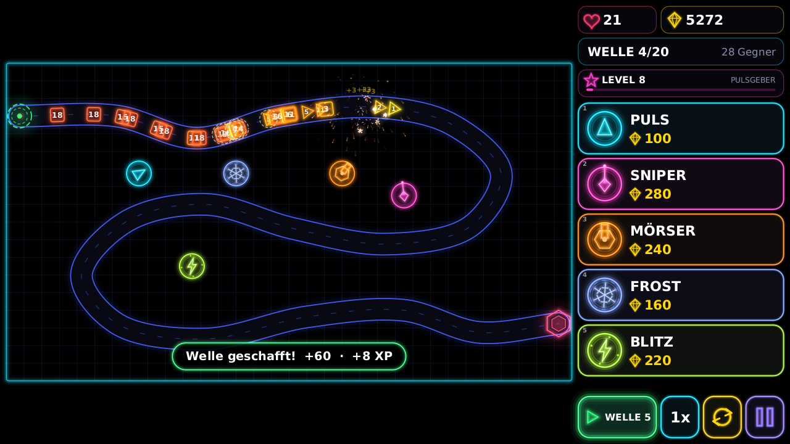
</p>

## Was drin ist

- **5 Turmklassen**, jede mit eigener Rolle und eigenem Neon-Symbol (siehe unten).
- **3 Upgrade-Kategorien pro Turm** – *Reichweite*, *Schaden* und *Tempo* – mit je 5 Stufen.
- **Wellen wie bei Bloons TD**: Welle manuell starten (auch früher!), Tempo 1×/2×/3×, automatischer Wellenstart, Pause.
- **Gegner tragen ihre Lebenspunkte als Zahl auf sich**. Die Farbe folgt den aktuellen HP (gelb → orange → rot → pink
  → violett → indigo), die Form zeigt die Art.
- **Feuerwerk**, wenn ein Gegner zerstört wird – mit Funken-Schweifen, Ringen und knisternden Nachzündern.
- **Hauptmenü** mit lebendigem Hintergrund (ein Bot verteidigt dort im Dauerlauf Level 1) und **Levelauswahl**.
- **Level 1 „Serpentine“** mit 20 Wellen und Titan-Bossen in Welle 10 und 20.
- **Level-Editor**: eigene Pfade per Punkten *oder freihändig* zeichnen, Pfade glätten sich zu Kurven, Rückgängig,
  Probespielen, Speichern. Eigene Level erscheinen in der Levelauswahl.
- **Spielerprofil mit Fortschritt**: Du startest auf Level 1 mit nur *einem* Turm (PULS). Jede besiegte Welle bringt XP,
  mit den Spielerleveln schaltest du FROST, MÖRSER, BLITZ und SNIPER frei und bekommst dauerhaft mehr Startgeld und
  Start-Leben – siehe [Fortschritt](#fortschritt).
- **Endlosmodus bis Welle 1000**: Nach dem Sieg über die 20 Wellen geht es mit **ENDLOS WEITER** weiter – mit
  Meisterstufen für alle Upgrades, Tempo 5× und Wellen, die bis über 1000 hinaus tragen
  (siehe [Endlosmodus](#endlosmodus)).
- **Speichern und Fortsetzen**: Das Spiel sichert den laufenden Lauf automatisch; nach dem Schließen der App geht es
  mit **FORTSETZEN** an derselben Stelle weiter.
- **Cloud-Speicher über GitHub**: Profil, eigene Level und laufende Spiele lassen sich in einem *privaten GitHub-Gist*
  sichern und auf jedem Gerät laden – siehe [Speichern, Fortsetzen und Cloud](#speichern-fortsetzen-und-cloud).
- **Handy-Oberfläche mit viel Platz**: Auf dem iPhone ist die Leiste **ein- und ausklappbar**; im Hochformat liegt die
  Karte um 90° gedreht und füllt die ganze Höhe (Kartengröße gegenüber vorher: +20 % quer, +60 % hoch).
- **Physik-Fundament** für die Weiterentwicklung: fester Zeitschritt, Pfade nach Bogenlänge, Broad-Phase,
  kontinuierliche Kollision, Zielvorhersage, deterministische Simulation (siehe [docs/ENTWICKLUNG.md](docs/ENTWICKLUNG.md)).

| Hauptmenü | Levelauswahl | Level-Editor |
|:--:|:--:|:--:|
| 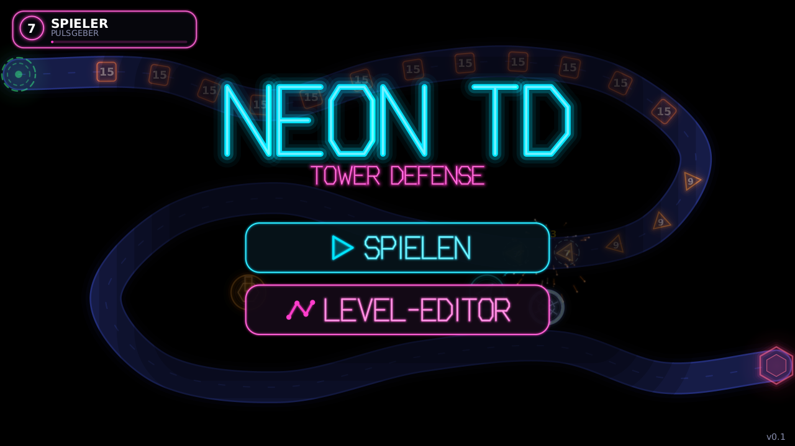 | 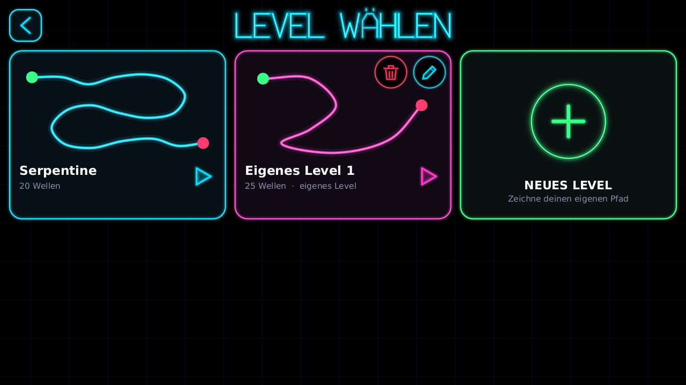 | 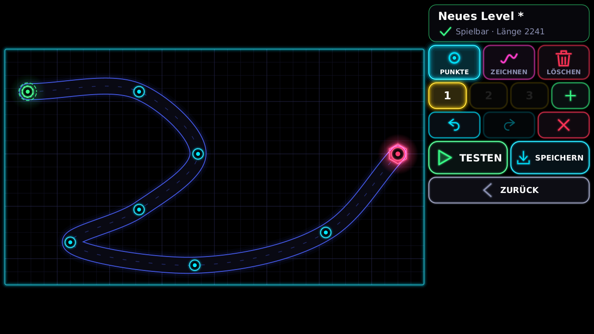 |

| iPhone quer | iPhone quer, Leiste eingeklappt | iPhone quer, Turm gewählt |
|:--:|:--:|:--:|
| 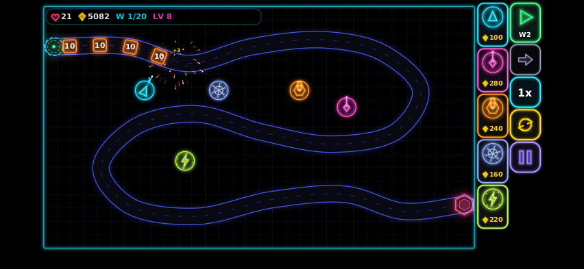 | 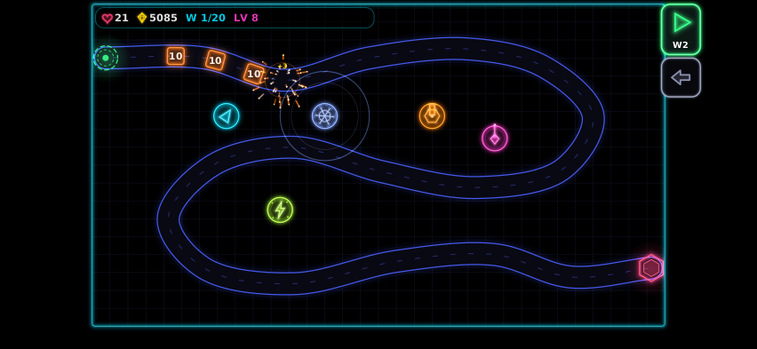 | 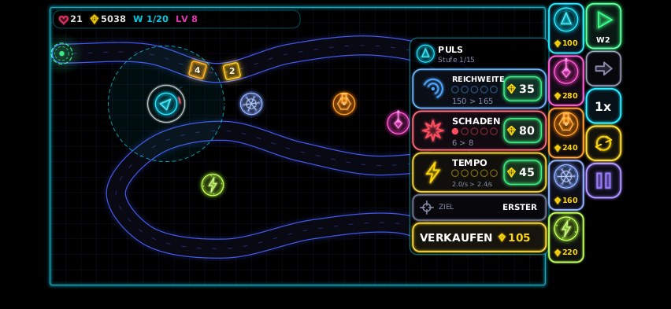 |

| iPhone hoch (Karte gedreht) | iPhone hoch, Turm gewählt | Profil |
|:--:|:--:|:--:|
| 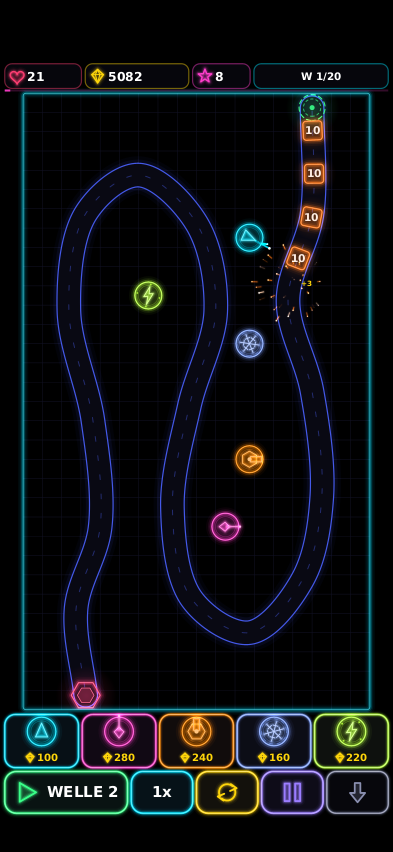 | 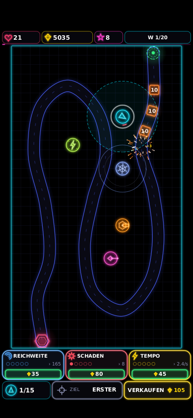 | 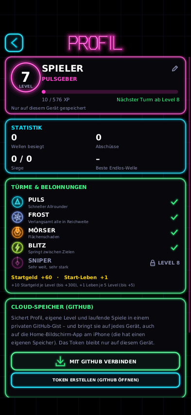 |

<p align="center">
  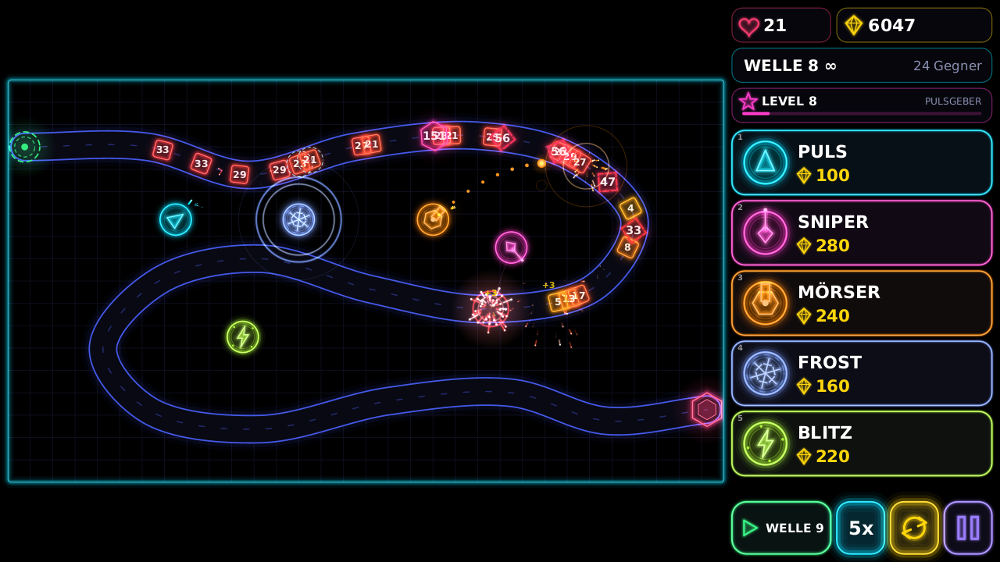<br>
  <sub>Endlosmodus: „WELLE 8 ∞“, Tempo bis 5×, Meisterstufen für alle Upgrades</sub>
</p>

## Spielen

### Im Browser und auf dem iPhone (empfohlen)

Die Web-Version ist eine statische Seite. Das Repository enthält einen GitHub-Workflow, der sie baut und auf
**GitHub Pages** veröffentlicht:

1. Im Repository **Settings → Pages → Source: „GitHub Actions“** einmalig auswählen
   (bei privaten Repositories hängt die Verfügbarkeit von deinem GitHub-Tarif ab).
2. Der Workflow *Build und Veröffentlichung* läuft bei jedem Push, führt alle Tests aus und veröffentlicht die Seite,
   sobald etwas im **Standard-Branch** des Repositories landet. Solange Pages nicht aktiviert ist, meldet der Lauf nur
   eine Warnung; nach dem Aktivieren unter **Actions** den letzten Lauf öffnen und **Re-run all jobs** wählen.
3. Danach liegt das Spiel unter `https://<dein-name>.github.io/<repository>/` – bei diesem Repository
   `https://t-eilzeitgott.github.io/td-0/`.

Die Artefakte jedes Laufs (Web-Version als Ordner, Desktop-Paket als ZIP) lassen sich außerdem direkt auf der
Actions-Seite herunterladen.

**iPhone:** Adresse in **Safari** öffnen → **Teilen** → **„Zum Home-Bildschirm“**. Danach startet Neon TD im
Vollbild wie eine App und funktioniert nach dem ersten Laden auch **ohne Internet**. Quer- und Hochformat nutzen den
Platz jetzt gut: quer sitzt eine schmale Leiste am rechten Rand, hoch liegt die Karte gedreht (Pfad von oben nach
unten) über einer Leiste am unteren Rand. Der **Pfeil-Knopf** klappt die Leiste ein – dann ist die Karte so groß wie
möglich – und wieder aus; die Wahl wird gemerkt.

> **Gut zu wissen:** Der Safari-Tab und die Home-Bildschirm-App haben auf dem iPhone **getrennte Speicher**. Wer
> beides benutzt, sieht dort zunächst verschiedene Profile. Der [Cloud-Speicher](#speichern-fortsetzen-und-cloud)
> verbindet sie.

Ohne GitHub Pages geht es genauso mit jedem anderen statischen Hosting: den Ordner `web/build/dist` (siehe unten)
hochladen.

### Lokal bauen und im Browser öffnen

Benötigt wird nur ein **JDK 17 oder neuer** – Gradle lädt der mitgelieferte Wrapper selbst.

```bash
./gradlew :web:assembleWeb
python3 -m http.server 8080 -d web/build/dist     # oder ein beliebiger anderer Webserver
```

Dann `http://localhost:8080` öffnen. Zum Testen auf dem iPhone im selben WLAN `http://<IP-des-PCs>:8080` aufrufen
(der Offline-Modus braucht HTTPS bzw. `localhost`, das Spiel läuft aber auch ohne ihn).

Am PC geht es sogar noch einfacher: `web/build/dist/index.html` per **Doppelklick** im Browser öffnen – ganz ohne
Server. Dasselbe gilt für das ZIP *neon-td-web*, das jeder Workflow-Lauf auf der Actions-Seite bereitstellt.

### Desktop-Anwendung

```bash
./gradlew :desktop:run                # direkt starten
./gradlew :desktop:distZip            # Paket bauen: desktop/build/distributions/neon-td-*.zip
```

Das ZIP enthält `bin/neon-td` (bzw. `neon-td.bat` unter Windows); eine Java-Laufzeit ab Version 17 muss installiert sein.
`F11` schaltet Vollbild um. Eigene Level liegen in `~/.neon-td/save.properties`.

## Bedienung

| | Maus / PC | Finger / iPhone |
|---|---|---|
| **Turm bauen** | Karte im Shop anklicken, dann auf die Karte klicken – oder vom Shop auf die Karte **ziehen** | Karte antippen und Ziel antippen – oder vom Shop **ziehen** (die Vorschau schwebt über dem Finger) |
| **Turm verbessern** | Turm anklicken → Panel mit *Reichweite / Schaden / Tempo* | Turm antippen |
| **Verkaufen** | Im Panel „Verkaufen“ (zweimal bestätigen), 70 % Erstattung | dito |
| **Zielwahl** | Im Panel: Erster · Letzter · Stärkster · Nächster | dito |
| **Wellen** | `START` / `Leertaste`; `1×/2×/3×` (im Endlosmodus bis `5×`) = `F`; Schleife = Auto-Start; Pause = `P` / `Esc` | Schaltflächen in der Leiste (quer rechts, hoch unten) |
| **Leiste ein-/ausklappen** | – (am Laptop immer sichtbar) | Pfeil-Knopf in der Leiste |

Weitere Tasten: `1`–`5` Turm wählen · `Q` `W` `E` Upgrade Reichweite/Schaden/Tempo · `Tab` Zielwahl · `X`/`Entf`
verkaufen · Rechtsklick bricht ab. Gesperrte Türme (Schloss mit „LV n“) lassen sich erst ab dem genannten Spielerlevel
bauen.

## Die fünf Türme

| Turm | Preis | Reichweite | Schaden | Tempo | Rolle |
|---|---:|---:|---:|---:|---|
| **PULS** (cyan) | 100 | 150 | 4 | 2,0/s | Schneller Allrounder. Kugeln zielen auf die *vorhergesagte* Position |
| **SNIPER** (magenta) | 280 | 330 | 34 | 0,5/s | Sehr weit, sehr stark; der Strahl trifft sofort |
| **MÖRSER** (orange) | 240 | 235 | 14 | 0,6/s | Granate mit Flächenschaden (zum Rand hin schwächer) |
| **FROST** (blau) | 160 | 108 | 2 | 0,7/s | Nova verlangsamt alle Gegner in Reichweite (stärker mit Schadensstufen) |
| **BLITZ** (grün) | 220 | 142 | 5 | 1,1/s | Springt auf bis zu 4 Ziele, jeder Sprung 25 % schwächer |

Jede der drei Kategorien hat 5 Stufen: *Reichweite* bis ×1,6 · *Schaden* bis ×7 · *Tempo* bis ×3,1. Die drei farbigen
Bögen um den Turm zeigen den Ausbau (blau = Reichweite, rot = Schaden, gelb = Tempo).

## Die Gegner

| Gegner | Form | Besonderheit |
|---|---|---|
| Block | Quadrat | Standard |
| Dart | Dreieck | schnell, wenig HP |
| Splitter | gestrichelte Raute | zerfällt in 3 Minis |
| Mini | Kreis | klein und flink |
| Koloss | Sechseck | langsam, sehr zäh, kostet 3 Leben |
| Titan | Achteck | Boss, kostet 10 Leben |

Du startest mit 500 ◆ und 20 Leben (plus Startbonus aus dem Spielerlevel). Abschüsse und besiegte Wellen bringen
Geld; ein Gegner, der das Ziel erreicht, kostet Leben.

## Fortschritt

Dein **Spielerlevel** wächst mit jeder besiegten Welle (6 XP + Wellennummer, doppelt bei Titan-Wellen) und mit dem
ersten Sieg über ein Level (+300 XP, danach +100). Das Profil siehst du über die Karte oben links im Hauptmenü.

| Spielerlevel | Freischaltung |
|---:|---|
| 1 | **PULS** |
| 2 | **FROST** |
| 4 | **MÖRSER** |
| 6 | **BLITZ** |
| 8 | **SNIPER** |

Dazu gibt es dauerhafte Belohnungen: **+10 Startgeld je Level** (bis +300) und **+1 Start-Leben je 5 Level** (bis +5).
Titel wie *Funke*, *Wächter*, *Architekt* oder *Titanbezwinger* zeigen den Rang. Als Maßstab: Der erste vollständige
Durchgang von Level 1 bringt Level 4 (772 XP), 1000 Endlos-Wellen etwa Level 63. Die Testspiele aus dem Level-Editor
zählen nicht für das Profil.

## Endlosmodus

Nach dem Sieg über die letzte Welle erscheint **ENDLOS WEITER** (und in der Levelauswahl, sobald das Level einmal
gewonnen wurde, **ENDLOSMODUS** für einen frischen Start). Dann gilt:

- Es gibt keinen Sieg mehr – nur noch „wie weit kommst du“. Alle 10 besiegten Wellen kommt ein verlorenes Leben zurück.
- **Meisterstufen:** Reichweite, Schaden und Tempo lassen sich über Stufe 5 hinaus ausbauen (Schaden bis Stufe 60,
  Tempo bis 18, Reichweite bis 12). Jede Meisterstufe macht den Turm um einen festen Faktor stärker und ist um den
  Faktor 1,36 teurer (Schaden ×1,23 und Tempo ×1,10 je Stufe, Reichweite +0,07) – gold angezeigt als „+n“.
- **Tempo 5×** und ein früherer automatischer Wellenstart, damit die Läufe nicht endlos dauern (eine Welle braucht im
  Schnitt ~40 s; 1000 Wellen sind bei 5× gut zwei Stunden).
- HP-Zahlen und Preise werden kurz geschrieben (`15K`, `2.3M`).

**Wie das bis Welle 1000 trägt:** Die Lebenspunkte wachsen quadratisch und ab Welle 100 zusätzlich leicht
exponentiell (Welle 1000: rund 16 Mio. für einen Block, 470 Mio. für einen Titan – noch im `int`-Bereich). Die *Zahl*
der Gegner ist begrenzt (höchstens ~240 je Welle), damit Bildschirm und Rechenzeit stabil bleiben. Prämien wachsen
langsamer als die HP (Exponent 0,625), dafür sorgen die Meisterstufen für den Ausgleich. Geld, Schaden und Preise sind
nach oben begrenzt, sodass nichts überlaufen kann. `EndlessProbe` lässt einen einfachen Bot 1000 Wellen spielen:
Er schafft es gerade eben (Leben 20, Welle 1000 dauert dann ~80 s) – ein menschlicher Spieler mit besserer Strategie
hat Luft. Ein Test (`EndlessTest`) sichert die Zahlen ab.

## Speichern, Fortsetzen und Cloud

**Lokal:** Profil, eigene Level und der laufende Lauf liegen im Speicher des Geräts (`localStorage` im Browser, Datei
`~/.neon-td/save.properties` auf dem Desktop). Der Lauf wird alle paar Sekunden und nach jeder besiegten Welle
gesichert, außerdem beim Pausieren, beim Verlassen und wenn die App in den Hintergrund geht. In der Levelauswahl
erscheint dann **FORTSETZEN · WELLE n**. Gesichert wird, sobald eine Welle fertig „ausgespielt“ ist (alle Gegner sind
erschienen); Geschosse und Effekte gehören nicht dazu.

**Über GitHub? Ja – mit einem privaten Gist.** GitHub hat keinen Speicher „pro Spieler“ für eine statische Seite, aber
jedes GitHub-Konto kann **Gists** (kleine private Dateien) anlegen. Das Spiel nutzt genau einen davon
(`neon-td-save.json`) und gleicht Profil, eigene Level und den laufenden Lauf dort ab. Einrichten (einmalig, ~1 Minute):

1. Im Spiel **Profil → CLOUD-SPEICHER → TOKEN ERSTELLEN** öffnet die GitHub-Seite mit bereits gesetzter Berechtigung
   *gist* (oder selbst: GitHub → Settings → Developer settings → Personal access tokens → *Generate new token
   (classic)*, Haken nur bei **gist**).
2. **Expiration: „No expiration“** wählen, damit die Verbindung lange hält, dann **Generate token** und den Text
   (`ghp_…`) kopieren.
3. Im Spiel **MIT GITHUB VERBINDEN** und das Token einfügen. Fertig: Das Spiel legt den privaten Gist an und gleicht ab –
   beim Start, nach Änderungen (höchstens alle 3 Minuten), beim Verlassen der App und am Ende eines Spiels.
4. Auf weiteren Geräten (oder in der Home-Bildschirm-App) dasselbe Token einfügen – der Stand kommt von selbst.

Der Abgleich **führt zusammen, statt zu überschreiben**: Zähler und Rekorde nehmen den größeren Wert, gewonnene Level
werden vereinigt, eigene Level und gelöschte Level werden per Zeitstempel abgeglichen, bei laufenden Spielen gewinnt der
jüngere. Wer auf zwei Geräten gespielt hat, verliert dadurch keinen Fortschritt. Als Anzeigename dient der GitHub-Name,
solange du keinen eigenen gewählt hast (im Profil über den Stift änderbar).

**Datenschutz und Sicherheit:** Das Token bleibt **ausschließlich im lokalen Speicher dieses Geräts** und wird nur an
`api.github.com` gesendet – nie in den Gist geschrieben, nie an einen anderen Server. Es kann *nur* Gists lesen und
schreiben (keine Repositories). Wer an dein entsperrtes Gerät kommt, könnte es auslesen; widerrufen lässt es sich
jederzeit unter github.com/settings/tokens. **TRENNEN** entfernt es vom Gerät (Spielstand und Cloud-Kopie bleiben). Das
Spiel lädt keine fremden Skripte, in die Seite eingeschleuste Fremdskripte sind also nicht zu befürchten.

**Ohne Konto:** *Profil → SICHERUNG PER CODE* kopiert Profil und eigene Level als Text (`NTD1:…`), den man auf einem
anderen Gerät einfügt (auch ein ungültiger Code richtet nichts an). Gleichzeitig bittet das Spiel den Browser, den
Speicher dauerhaft zu halten; die Home-Bildschirm-App ist nach Apples Regeln außerdem von der automatischen Löschung
nach längerer Nichtnutzung ausgenommen, normale Safari-Tabs nicht.

## Level-Editor

Hauptmenü → **Level-Editor** (oder in der Levelauswahl **Neues Level**).

- **Punkte** – tippen setzt einen Punkt (nahe am Pfad wird er eingefügt, sonst hinten angehängt); Punkte lassen sich
  ziehen. Der Pfad ist ein glatter Spline durch alle Punkte und zeigt die echte Spurbreite.
- **Zeichnen** – mit Finger oder Maus freihändig einen Pfad zeichnen; er wird automatisch zu wenigen Punkten vereinfacht.
- **Löschen** – Punkte antippen, um sie zu entfernen.
- **1 · 2 · 3 · +** – bis zu drei Pfade; Gegner wechseln sich zwischen ihnen ab.
- **Rückgängig / Wiederholen**, **✕** leert den aktuellen Pfad.
- **Testen** spielt das Level sofort probe, **Speichern** legt es in der Levelauswahl ab.

Ein spielbares Level braucht mindestens einen Pfad mit mindestens 700 Einheiten Länge, alle Punkte im Spielfeld.
Die Wellen für eigene Level werden automatisch erzeugt (25 Wellen mit steigender Schwierigkeit). Gespeichert wird im
Browser (`localStorage`) bzw. auf dem Desktop in einer Datei.

## Für Entwickler

```
core/      reines Java ohne Abhängigkeiten – Simulation, Physik, Darstellung, UI, Szenen (läuft überall)
desktop/   Java2D-Fenster, Screenshot-Werkzeug, Icon-Generator
web/       TeaVM-Brücke: Java → JavaScript, Canvas2D, Zeiger-Ereignisse, PWA (Manifest, Service Worker, Icons)
```

```bash
./gradlew test                  # 105 Tests: Physik, Simulation, Endlos, Fortschritt, Speichern/Cloud-Abgleich, Layouts, Szenen
./gradlew build                 # alles bauen: Tests, Web (build/dist), Desktop-Paket
./gradlew :web:assembleWeb -PdebugJs      # Web-Version unminifiziert, zum Debuggen
./scripts/screenshots.sh        # Screenshots der Doku neu erzeugen (läuft ohne Fenster)
node scripts/web-smoke.mjs      # Browser-Test der echten Web-Version in Chromium (Handy-Layouts, Speichern, Cloud mit Mock-GitHub)
```

Wie die Physik, die Simulation und die Darstellung zusammenhängen und wie man neue Türme, Gegner, Level oder eine
Fortschritts-Schicht ergänzt, steht in **[docs/ENTWICKLUNG.md](docs/ENTWICKLUNG.md)**.

## Ausblick

Naheliegende nächste Schritte: weitere Level mit eigenen Wellen (Level werden über den Spielerlevel freigeschaltet), Ton,
weitere Gegner- und Turmarten, Sterne pro Level, Bestenlisten über die Gists und Wiederholungen aus aufgezeichneten
Befehlen (die Simulation ist deterministisch). Der Spielstand-Mechanismus (`neontd.save`) und das Profil
(`neontd.progress`) sind dafür vorbereitet – siehe [docs/ENTWICKLUNG.md](docs/ENTWICKLUNG.md).
